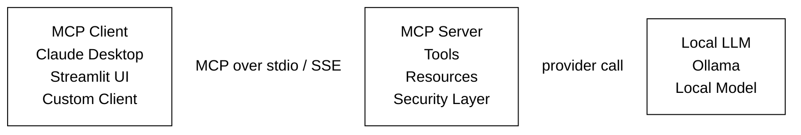
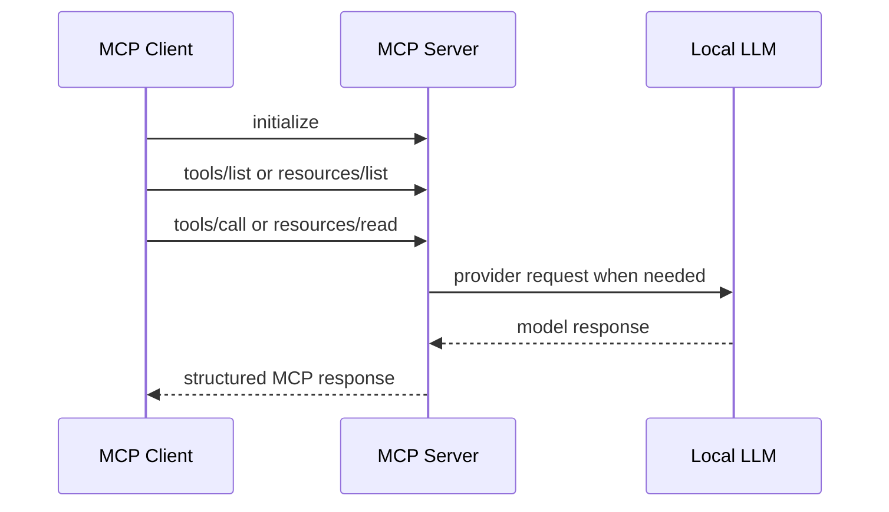
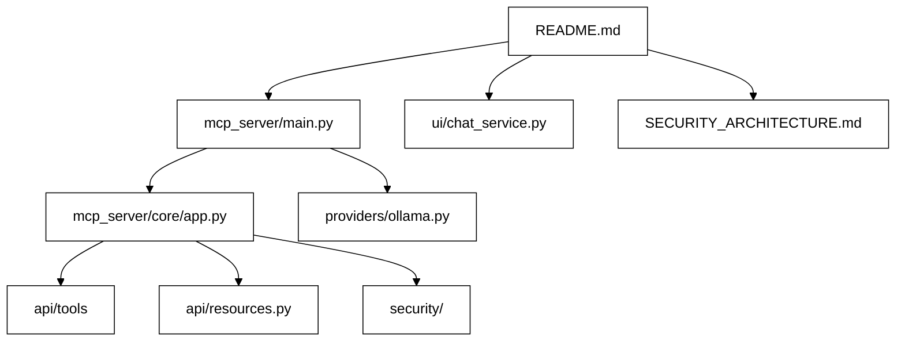
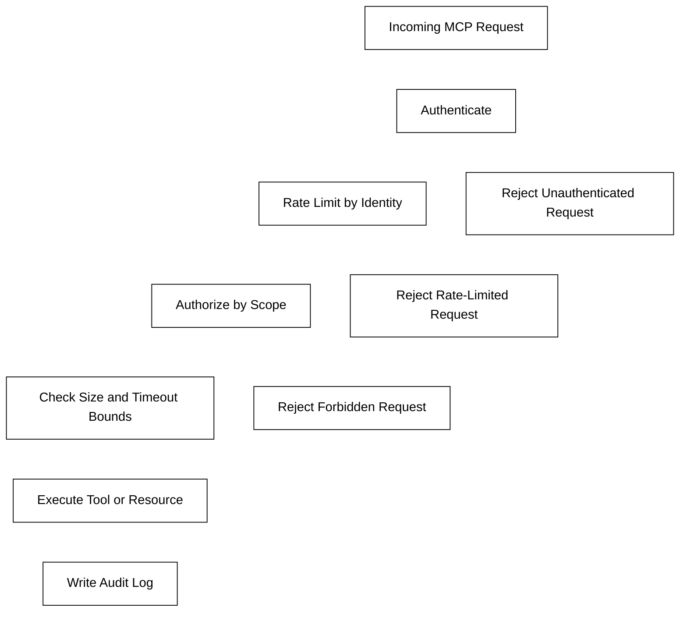
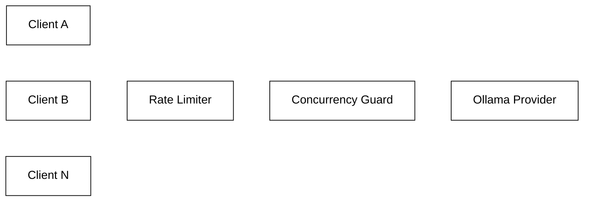

# Local MCP Server, Client, and Local LLM

This repo is a beginner-friendly example of how to build a local [Model Context Protocol](https://modelcontextprotocol.io/) stack:

- an MCP server
- an MCP client
- local tools and resources
- a local LLM backend using Ollama

It is designed to do two jobs at once:

1. help you run a working local MCP project
2. help you understand what MCP is and how its pieces fit together

No cloud account is required. No hosted model is required. Everything can run on your own machine.

Security is a main concern in this repo. The goal is not just to show the happy-path MCP flow, but also to show how a local MCP stack can be built with real guardrails around tools, resources, and LLM access.

---

## What Is MCP?

MCP, or Model Context Protocol, is a standard way for an AI client to talk to tools, resources, and prompts exposed by a server.

In simple terms:

- the **client** asks for available capabilities
- the **server** exposes those capabilities in a standard format
- the **LLM** can use those capabilities through the client-server connection

If you are brand new, the easiest mental model is:

- **MCP client** = the app that wants to use tools or fetch context
- **MCP server** = the app that publishes those tools/resources
- **Tool** = an action, like `ollama-chat` or `echo`
- **Resource** = read-only context, like `config://server`
- **Transport** = how client and server talk, such as `stdio` or `SSE`

---

## What This Repo Teaches

By reading and running this project, you can learn:

- how an MCP server is structured
- how MCP tools are registered
- how MCP resources are exposed
- how a client connects and calls tools
- how a local LLM can sit behind an MCP tool
- how security layers like auth, scopes, rate limiting, and audit logging can be added

If your main interest is security, read [SECURITY_ARCHITECTURE.md](/Users/shashank/MCPP/mcp-server/SECURITY_ARCHITECTURE.md:1) alongside this README.

---

## Architecture



In this repo:

- the MCP server lives in [`mcp_server/`](/Users/shashank/MCPP/mcp-server/mcp_server)
- the local chat client lives in [`ui/`](/Users/shashank/MCPP/mcp-server/ui)
- the local LLM provider is Ollama, wired through [`mcp_server/providers/ollama.py`](/Users/shashank/MCPP/mcp-server/mcp_server/providers/ollama.py:1)
- the security design is explained in [SECURITY_ARCHITECTURE.md](/Users/shashank/MCPP/mcp-server/SECURITY_ARCHITECTURE.md:1)

---

## MCP Concepts With Tiny Examples

These are teaching snippets first. The full implementation in this repo is more structured and secure.

### 1. Minimal MCP Server

This is the basic idea of an MCP server: create a server and register capabilities.

```python
from mcp.server.fastmcp import FastMCP

app = FastMCP("Example Server")

@app.tool()
def echo(message: str) -> str:
    return f"Echo: {message}"

app.run(transport="stdio")
```

In this repo, that idea is extended by [`SecureMCP`](/Users/shashank/MCPP/mcp-server/mcp_server/core/app.py:17), which adds authentication, authorization, rate limiting, and audit logging around the MCP server.

That security-first design is described in more depth in [SECURITY_ARCHITECTURE.md](/Users/shashank/MCPP/mcp-server/SECURITY_ARCHITECTURE.md:1).

### 2. Minimal Tool

A tool is something the client can execute.

```python
@app.tool(name="add")
def add(a: int, b: int) -> int:
    return a + b
```

In this repo, tool registration happens in:

- [`mcp_server/api/tools/util.py`](/Users/shashank/MCPP/mcp-server/mcp_server/api/tools/util.py:1)
- [`mcp_server/api/tools/llm.py`](/Users/shashank/MCPP/mcp-server/mcp_server/api/tools/llm.py:1)

Examples from this repo:

- `echo`
- `ollama-chat`
- `ollama-list-models`

### 3. Minimal Resource

A resource is read-only context exposed by the server.

```python
@app.resource("config://app")
def app_config() -> str:
    return '{"name": "demo", "env": "local"}'
```

In this repo, the built-in resource is registered in [`mcp_server/api/resources.py`](/Users/shashank/MCPP/mcp-server/mcp_server/api/resources.py:1).

### 4. Minimal Client

A client connects to the MCP server, initializes the session, and then calls tools or reads resources.

```python
from mcp import ClientSession
from mcp.client.sse import sse_client

async with sse_client("http://127.0.0.1:8080/sse") as (read_stream, write_stream):
    async with ClientSession(read_stream, write_stream) as session:
        await session.initialize()
        result = await session.call_tool("echo", arguments={"message": "hello"})
```

In this repo, the working client logic is in [`ui/chat_service.py`](/Users/shashank/MCPP/mcp-server/ui/chat_service.py:18).

---

## How MCP Flows In Practice

Here is the normal interaction pattern:

1. The client connects to the server.
2. The client sends `initialize`.
3. The client asks what tools/resources exist.
4. The client calls a tool or reads a resource.
5. The server performs the action and returns structured data.



### Example: `initialize`

```json
{
  "jsonrpc": "2.0",
  "method": "initialize",
  "params": {
    "protocolVersion": "2024-11-05",
    "clientInfo": {
      "name": "demo-client",
      "version": "1.0.0"
    },
    "capabilities": {}
  },
  "id": 1
}
```

### Example: `tools/list`

```json
{
  "jsonrpc": "2.0",
  "method": "tools/list",
  "params": {},
  "id": 2
}
```

### Example: `tools/call`

```json
{
  "jsonrpc": "2.0",
  "method": "tools/call",
  "params": {
    "name": "echo",
    "arguments": {
      "message": "hello from MCP"
    }
  },
  "id": 3
}
```

---

## How This Repo Maps To Those Concepts

If you want to learn the codebase in a good order, read these files first:

1. [`README.md`](/Users/shashank/MCPP/mcp-server/README.md:1)
2. [`mcp_server/main.py`](/Users/shashank/MCPP/mcp-server/mcp_server/main.py:1)
3. [`mcp_server/core/app.py`](/Users/shashank/MCPP/mcp-server/mcp_server/core/app.py:17)
4. [`mcp_server/api/tools/util.py`](/Users/shashank/MCPP/mcp-server/mcp_server/api/tools/util.py:1)
5. [`mcp_server/api/tools/llm.py`](/Users/shashank/MCPP/mcp-server/mcp_server/api/tools/llm.py:1)
6. [`mcp_server/api/resources.py`](/Users/shashank/MCPP/mcp-server/mcp_server/api/resources.py:1)
7. [SECURITY_ARCHITECTURE.md](/Users/shashank/MCPP/mcp-server/SECURITY_ARCHITECTURE.md:1)
8. [`mcp_server/providers/ollama.py`](/Users/shashank/MCPP/mcp-server/mcp_server/providers/ollama.py:15)
9. [`ui/chat_service.py`](/Users/shashank/MCPP/mcp-server/ui/chat_service.py:18)

Quick guide to what each area does:

- [`mcp_server/main.py`](/Users/shashank/MCPP/mcp-server/mcp_server/main.py:1): entry point, wiring, startup
- [`mcp_server/core/app.py`](/Users/shashank/MCPP/mcp-server/mcp_server/core/app.py:17): MCP wrapper plus security interception
- [`mcp_server/config/settings.py`](/Users/shashank/MCPP/mcp-server/mcp_server/config/settings.py:143): config loading and profiles
- [`mcp_server/security/`](/Users/shashank/MCPP/mcp-server/mcp_server/security): auth, scopes, rate limiting, audit logging
- [SECURITY_ARCHITECTURE.md](/Users/shashank/MCPP/mcp-server/SECURITY_ARCHITECTURE.md:1): why these security layers exist and what risks they address
- [`mcp_server/providers/`](/Users/shashank/MCPP/mcp-server/mcp_server/providers): LLM backend abstraction
- [`ui/`](/Users/shashank/MCPP/mcp-server/ui): local client application
- [`tests/`](/Users/shashank/MCPP/mcp-server/tests): working examples of behavior and expected usage



---

## Features In This Repo

- MCP server with `stdio` and `SSE`
- local MCP client built with Streamlit
- Ollama-backed local LLM tool
- pluggable provider layer
- security-first wrapper around MCP request handling
- request timeout and request size protection
- auth keys for protected access
- scope-based authorization
- identity-based rate limiting
- bounded concurrency to protect the local LLM backend
- audit logging
- typed config and validation with Pydantic
- basic tests for config, auth, rate limiting, client behavior, and concurrency

---

## Project Structure

```text
mcp-server/
├── mcp_server/
│   ├── api/
│   │   ├── resources.py
│   │   └── tools/
│   ├── config/
│   ├── core/
│   ├── providers/
│   ├── security/
│   └── main.py
├── ui/
├── tests/
├── config.yaml
├── pyproject.toml
└── Makefile
```

---

## Prerequisites

- Python 3.11 or newer
- [Ollama](https://ollama.com/)
- at least one local Ollama model, for example `llama3.2`

---

## Quick Start

### 1. Install

```bash
git clone <repo-url>
cd mcp-server
python3 -m venv .venv
source .venv/bin/activate
make install
```

### 2. Start Ollama and pull a model

```bash
ollama serve
ollama pull llama3.2
```

### 3. Run the MCP server

For local beginner use, the defaults are enough:

```bash
make run
```

This starts the server with `stdio` transport.

### 4. Run the local client

```bash
make run-client
```

The UI will open at [http://localhost:8501](http://localhost:8501).

---

## Running With SSE

If you want the server to accept HTTP/SSE connections:

```bash
python3 -m mcp_server.main --transport sse
```

By default, the repo config uses:

- host: `127.0.0.1`
- port: `8080`

So the SSE endpoint is:

```text
http://127.0.0.1:8080/sse
```

Example request:

```bash
curl -H "X-MCP-Client-Key: your-secret-key" http://127.0.0.1:8080/sse
```

---

## Beginner Walkthrough

If your goal is to learn MCP, follow this order.

### Step 1. Start the server

```bash
make run
```

### Step 2. Read the server entry point

Open [`mcp_server/main.py`](/Users/shashank/MCPP/mcp-server/mcp_server/main.py:1).

Notice the flow:

- load settings
- create provider
- create auth, audit, and rate limiter
- create the secure MCP app
- register tools and resources
- run the server

### Step 3. Inspect a simple tool

Open [`mcp_server/api/tools/util.py`](/Users/shashank/MCPP/mcp-server/mcp_server/api/tools/util.py:1).

This is the easiest MCP concept in the repo:

```python
@app.tool(
    name="echo",
    description="Echo a message back to the caller",
    required_scopes=["tools:util:echo"]
)
def echo(message: str) -> str:
    return f"Echo: {message}"
```

This shows:

- how a tool is named
- how arguments are typed
- how a return value is sent back
- how the repo adds authorization scopes

### Step 4. Inspect the LLM tool

Open [`mcp_server/api/tools/llm.py`](/Users/shashank/MCPP/mcp-server/mcp_server/api/tools/llm.py:1).

This shows how an MCP tool can act as a safe wrapper around a local LLM backend.

### Step 5. Inspect the client

Open [`ui/chat_service.py`](/Users/shashank/MCPP/mcp-server/ui/chat_service.py:18).

This is where the client:

- connects over SSE
- initializes a session
- calls MCP tools
- handles authentication headers

### Step 6. Inspect the security layer

Open these files:

- [`mcp_server/security/auth.py`](/Users/shashank/MCPP/mcp-server/mcp_server/security/auth.py:1)
- [`mcp_server/security/interceptor.py`](/Users/shashank/MCPP/mcp-server/mcp_server/security/interceptor.py:1)
- [`mcp_server/security/rate_limiter.py`](/Users/shashank/MCPP/mcp-server/mcp_server/security/rate_limiter.py:1)
- [`mcp_server/security/audit.py`](/Users/shashank/MCPP/mcp-server/mcp_server/security/audit.py:1)

This is where the repo goes beyond a toy example.

---

## Security Model

This repo includes a practical local-first security setup, and security is treated as a main architectural concern rather than a later add-on.

For the full design rationale, threat framing, and diagrams, see [SECURITY_ARCHITECTURE.md](/Users/shashank/MCPP/mcp-server/SECURITY_ARCHITECTURE.md:1).

Why security matters so much in MCP:

- an MCP server exposes executable capabilities to AI clients
- if those capabilities are unprotected, anyone reaching the server may enumerate and call tools
- local LLM backends are expensive enough that they need protection from overload
- without auditability, it becomes hard to answer who invoked what and whether it succeeded
- without request bounds, large or hanging requests can degrade the whole service



### Modes

The server supports:

- `local`: convenient defaults for local use
- `dev`: development mode with relaxed behavior
- `prod`: strict mode requiring auth keys

### Authentication

- `stdio`: reads the client key from `MCP_CLIENT_KEY`
- `SSE`: reads `X-MCP-Client-Key` or `Authorization: Bearer <key>`

### Authorization

Tools and resources can require scopes.

Examples in this repo:

- `tools:util:echo`
- `tools:ollama:chat`
- `tools:ollama:list`

### Rate Limiting

Requests are bucketed by identity:

- authenticated users: by key fingerprint
- unauthenticated HTTP users: by client IP
- unauthenticated stdio users: shared anonymous label



### Audit Logging

Structured audit events are written to stderr when enabled.

### Security Architecture Reading Path

If you want to study the security design in order, read:

1. [SECURITY_ARCHITECTURE.md](/Users/shashank/MCPP/mcp-server/SECURITY_ARCHITECTURE.md:1)
2. [`mcp_server/core/app.py`](/Users/shashank/MCPP/mcp-server/mcp_server/core/app.py:17)
3. [`mcp_server/security/interceptor.py`](/Users/shashank/MCPP/mcp-server/mcp_server/security/interceptor.py:1)
4. [`mcp_server/security/auth.py`](/Users/shashank/MCPP/mcp-server/mcp_server/security/auth.py:1)
5. [`mcp_server/security/rate_limiter.py`](/Users/shashank/MCPP/mcp-server/mcp_server/security/rate_limiter.py:1)
6. [`mcp_server/security/audit.py`](/Users/shashank/MCPP/mcp-server/mcp_server/security/audit.py:1)

---

## Configuration

Configuration is loaded with this precedence:

1. environment variables
2. `config.yaml`
3. built-in defaults

Example config:

```yaml
server:
  host: "127.0.0.1"
  port: 8080
  transport: "stdio"

security:
  rate_limit: 100
  enable_audit_log: true

llm:
  provider: "ollama"
  base_url: "http://localhost:11434"
  default_model: "llama3"
```

Example environment variables:

```bash
export MCP_SERVER__MODE=prod
export MCP_SECURITY__AUTH_KEYS='["key1", "key2"]'
export MCP_CLIENT_KEY="key1"
```

The environment variable reference file is [`.env.example`](/Users/shashank/MCPP/mcp-server/.env.example:1).

---

## Manual Smoke Test

You can send raw JSON-RPC over `stdio` to understand the protocol shape.

```bash
export MCP_CLIENT_KEY="your-secret-key"

printf '%s\n%s\n' \
  '{"jsonrpc":"2.0","method":"initialize","params":{"protocolVersion":"2024-11-05","clientInfo":{"name":"cli","version":"0"},"capabilities":{}},"id":1}' \
  '{"jsonrpc":"2.0","method":"tools/list","params":{},"id":2}' \
  | python3 -m mcp_server.main
```

This is useful if you want to see MCP requests without a UI.

---

## Claude Desktop Integration

Add this to your Claude Desktop config:

```json
{
  "mcpServers": {
    "local-ollama": {
      "command": "python3",
      "args": ["-m", "mcp_server.main", "--transport", "stdio"],
      "cwd": "/path/to/MCPP/mcp-server"
    }
  }
}
```

---

## Built-In Tools

| Tool | Description |
|---|---|
| `echo` | Echo a message back |
| `ollama-chat` | Send chat messages to the local Ollama model |
| `ollama-list-models` | List locally available Ollama models |

## Built-In Resources

| URI | Description |
|---|---|
| `config://server` | Read-only JSON describing active server configuration |

---

## Development

```bash
make dev
make test
make lint
make check-ollama
make clean
```

---

## Current Limitations

This repo is a solid local learning project and a good implementation base, but it is not a perfect production platform yet.

Current limitations include:

- rate limiting is in-memory and process-local
- Ollama tool responses are not streamed
- the provider currently uses a local Ollama backend only
- the project is strongest as a local/self-hosted example, not a large distributed deployment

---

## If You Are Completely New To MCP

Start here:

1. Read the `What Is MCP?` section in this README.
2. Run the server and client locally.
3. Read [`mcp_server/main.py`](/Users/shashank/MCPP/mcp-server/mcp_server/main.py:1).
4. Read the `echo` tool in [`mcp_server/api/tools/util.py`](/Users/shashank/MCPP/mcp-server/mcp_server/api/tools/util.py:1).
5. Read the client flow in [`ui/chat_service.py`](/Users/shashank/MCPP/mcp-server/ui/chat_service.py:18).
6. Read [SECURITY_ARCHITECTURE.md](/Users/shashank/MCPP/mcp-server/SECURITY_ARCHITECTURE.md:1).
7. Read the security files once the basic flow makes sense.

If you do that in order, this repo becomes much easier to learn from.
