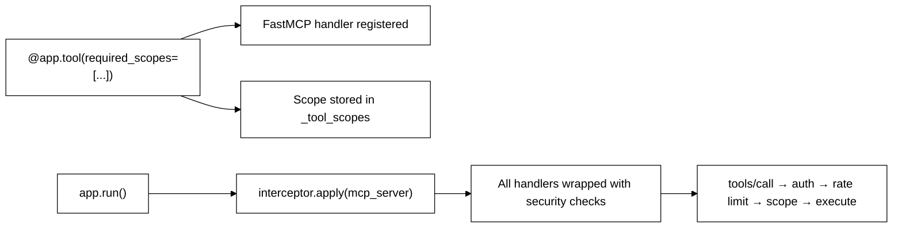
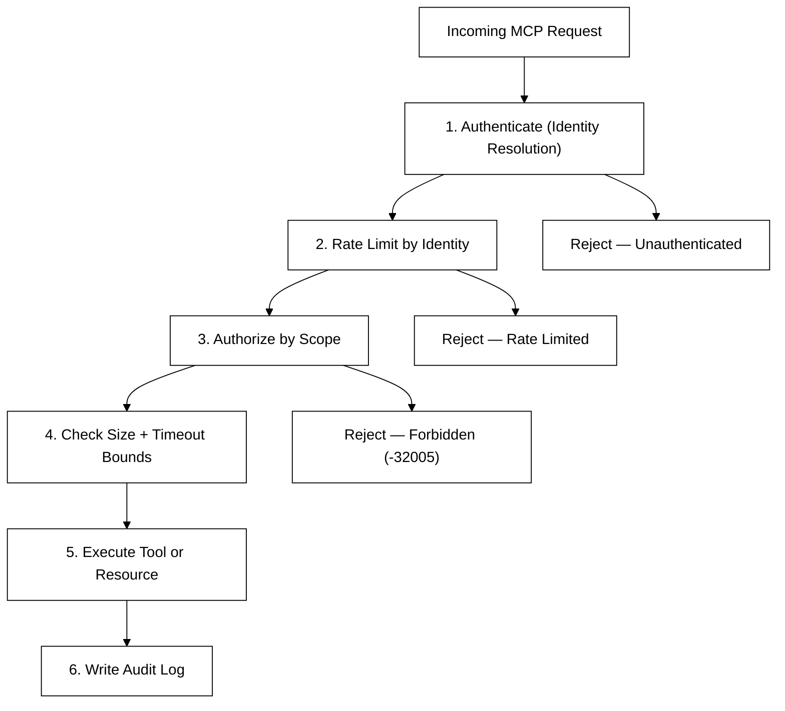
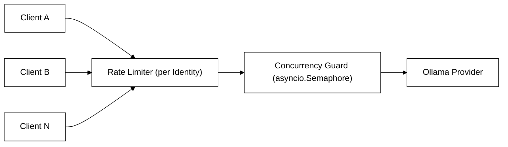
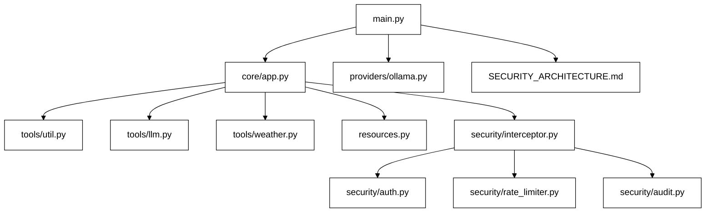

# Component 2: The MCP Server

This is the "brain" of the stack. It is a [FastMCP](https://github.com/jlowin/fastmcp)-based server that exposes tools and resources to MCP clients, backed by a local Ollama LLM, and wrapped in a custom production-grade security layer.

> [!NOTE]
> Before proceeding here, make sure you have completed **[Component 1: LLM Provider](../1-llm/README.md)** and Ollama is running with at least one model pulled.

---

## What This Server Does

- Exposes **MCP tools** that clients can discover and call.
- Proxies LLM inference through the `ollama-chat` and `ollama-list-models` tools, never exposing Ollama directly.
- Wraps every incoming request through a `SecurityInterceptor` that enforces authentication, authorization, rate limiting, and audit logging.
- Supports both `stdio` (local pipes) and `SSE` (HTTP) transports.

---

## MCP Concepts With Tiny Examples

These are teaching snippets — the absolute minimum code needed to understand each MCP primitive. The full implementation in this repo is more structured and secure, but everything ultimately builds on these ideas.

### 1. Minimal MCP Server

The basic idea: create a server, register capabilities, run it.

```python
from mcp.server.fastmcp import FastMCP

app = FastMCP("Example Server")

@app.tool()
def echo(message: str) -> str:
    return f"Echo: {message}"

app.run(transport="stdio")
```

In this repo, that idea is extended by `SecureMCP` in [`mcp_server/core/app.py`](./mcp_server/core/app.py), which adds authentication, authorization, rate limiting, and audit logging around the standard FastMCP server.

### 2. Minimal Tool

A tool is something the client can execute. It is registered with a decorator and typed:

```python
@app.tool(name="add")
def add(a: int, b: int) -> int:
    return a + b
```

In this repo, tool registration happens per file:

- [`mcp_server/tools/util.py`](./mcp_server/tools/util.py) — `echo`
- [`mcp_server/tools/llm.py`](./mcp_server/tools/llm.py) — `ollama-chat`, `ollama-list-models`
- [`mcp_server/tools/weather.py`](./mcp_server/tools/weather.py) — `weather-get`

### 3. Minimal Resource

A resource is read-only context exposed by the server. It is referenced by a URI:

```python
@app.resource("config://app")
def app_config() -> str:
    return '{"name": "demo", "env": "local"}'
```

In this repo, the built-in resource is registered in [`mcp_server/resources.py`](./mcp_server/resources.py) and is accessible at `config://server`.

### 4. SecureMCP — This Repo's Extension of FastMCP

`SecureMCP` (in [`mcp_server/core/app.py`](./mcp_server/core/app.py)) is a thin security wrapper around standard `FastMCP`. It is the central object that wires every component together.

**What it adds on top of vanilla FastMCP:**

| Feature | How |
|---------|-----|
| Scope registry | `_tool_scopes` and `_resource_scopes` dicts map each tool/resource name to a list of required scopes |
| Secure tool decorator | `.tool(required_scopes=[...])` registers the scope alongside the FastMCP handler |
| Secure resource decorator | `.resource(uri, required_scopes=[...])` does the same for resources |
| Interceptor wiring | `.run()` calls `interceptor.apply()` to wrap every low-level MCP handler *before* serving |

**What it looks like at construction time (from `main.py`):**

```python
app = SecureMCP(
    name="local-mcp-server",
    settings=settings,
    auth_provider=auth_provider,
    audit_logger=audit_logger,
    rate_limiter=rate_limiter,
)
```

**What registering a secure tool looks like:**

```python
@app.tool(
    name="echo",
    description="Echo a message back to the caller",
    required_scopes=["tools:util:echo"]
)
def echo(message: str) -> str:
    return f"Echo: {message}"
```

When a client calls `echo`, the `SecurityInterceptor` checks:
1. Is the caller authenticated?
2. Does their identity hold the `tools:util:echo` scope?
3. Are they within their rate limit?

Only if all three pass does the actual `echo` function run:



**Why this design?**

By keeping `SecureMCP` as a wrapper rather than a fork, the underlying FastMCP server remains standard and compatible with any MCP client. Security is layered *around* it, not baked into the protocol primitives — so you can strip it out, swap it, or extend it independently.

---

## Project Structure

```text
2-server/
├── mcp_server/
│   ├── main.py               ← entry point: wiring, startup
│   ├── models.py             ← shared Pydantic models
│   ├── resources.py          ← MCP resources (config://server)
│   ├── core/
│   │   └── app.py            ← SecureMCP wrapper + security interception
│   ├── config/
│   │   └── settings.py       ← config loading, profiles, Pydantic validation
│   ├── security/
│   │   ├── interceptor.py    ← protocol-level security funnel
│   │   ├── auth.py           ← identity resolution (key/IP)
│   │   ├── rate_limiter.py   ← per-identity rate limiting
│   │   └── audit.py          ← structured audit logging to stderr
│   ├── providers/
│   │   ├── ollama.py         ← Ollama provider + concurrency semaphore
│   │   └── manager.py        ← provider registry/abstraction
│   └── tools/
│       ├── util.py           ← echo tool
│       ├── llm.py            ← ollama-chat + ollama-list-models tools
│       └── weather.py        ← weather-get tool
├── tests/
│   ├── test_fastmcp.py
│   ├── test_chat_service.py
│   ├── test_rate_limit_identity.py
│   ├── test_concurrency.py
│   └── test_config_validation.py
├── config.yaml               ← default configuration
├── .env.example              ← all supported environment variables
├── Dockerfile                ← container build
├── pyproject.toml
└── SECURITY_ARCHITECTURE.md  ← deep dive into security design
```

---

## Prerequisites

- Python 3.11 or newer
- [Ollama](https://ollama.com/) running with at least one model (see [`1-llm/`](../1-llm/README.md))

---

## Installation

From the repo root, install all dependencies:

```bash
make install
```

Or from inside `2-server/` only:

```bash
cd 2-server
python3 -m venv .venv
source .venv/bin/activate
pip install -e ".[dev]"
```

---

## Quick Start

### 1. Run in stdio mode (simplest, for local testing)

```bash
make run
```

This starts the server with `stdio` transport — it reads/writes JSON-RPC on stdin/stdout.

### 2. Run in SSE mode (required for the Streamlit client)

```bash
make run-server-sse
```

Or manually:

```bash
python3 -m mcp_server.main --transport sse
```

The SSE endpoint is available at:

```
http://127.0.0.1:8080/sse
```

Example raw request:
```bash
curl -H "X-MCP-Client-Key: your-secret-key" http://127.0.0.1:8080/sse
```

---

## Configuration

Configuration is loaded with this precedence (highest to lowest):

1. Environment variables
2. `config.yaml`
3. Built-in defaults

**`config.yaml` example:**
```yaml
server:
  host: "127.0.0.1"
  port: 8080
  transport: "stdio"

security:
  rate_limit: 100
  enable_audit_log: true

llm:
  provider: "ollama"
  base_url: "http://localhost:11434"
  default_model: "llama3.2"
```

**Key environment variables:**
```bash
export MCP_SERVER__MODE=prod
export MCP_SECURITY__AUTH_KEYS='["key1", "key2"]'
export MCP_CLIENT_KEY="key1"
```

All supported environment variables are documented in [`.env.example`](./.env.example).

---

## Built-In Tools

| Tool | Scope Required | Description |
|------|----------------|-------------|
| `echo` | `tools:util:echo` | Echoes a message back to the caller |
| `ollama-chat` | `tools:ollama:chat` | Send a chat message list to the local Ollama model |
| `ollama-list-models` | `tools:ollama:list` | List all locally available Ollama models |
| `weather-get` | `tools:weather:get` | Fetch current weather for a location via wttr.in |

## Built-In Resources

| URI | Description |
|-----|-------------|
| `config://server` | Read-only JSON snapshot of the active server configuration |

---

## Security Model

This server implements a **Defense-in-Depth** security model at the protocol level. Every incoming MCP request — including `initialize`, `tools/list`, and `tools/call` — is routed through the `SecurityInterceptor` before any server logic executes.



### Authentication

- **SSE transport**: reads `X-MCP-Client-Key` header or `Authorization: Bearer <key>`
- **Stdio transport**: reads `MCP_CLIENT_KEY` environment variable

### Server Modes

| Mode | Behaviour |
|------|-----------|
| `local` | Convenient defaults, no auth key required |
| `dev` | Relaxed auth, useful for development |
| `prod` | Strict — requires auth keys, grants zero default scopes |

### Authorization (Least Privilege)

Tools declare the scopes they require at registration time. A client that holds `tools:weather:get` but tries to call `ollama-chat` receives a `-32005 Forbidden` error.

### Rate Limiting

Requests are bucketed by resolved identity:

- Authenticated clients → bucketed by SHA-256 fingerprint of their API key
- Unauthenticated SSE clients → bucketed by client IP address
- Unauthenticated stdio clients → shared anonymous label



### Audit Logging

Structured audit events are written to `stderr` (keeping `stdout` clean for stdio protocol traffic). Each event records the resolved identity, method invoked, and the final status: `SUCCESS`, `UNAUTHORIZED`, `FORBIDDEN`, `RATE_LIMITED`, or `ERROR`.

> [!TIP]
> For the full threat model, design rationale, and future enhancement paths (mTLS, OAuth2/OIDC, WebAssembly sandboxing, DLP), see [SECURITY_ARCHITECTURE.md](./SECURITY_ARCHITECTURE.md).

---

## Beginner Walkthrough: Reading the Code in Order

If your goal is to understand how the server works, read the files in this sequence:

### Step 1. Start the server
```bash
make run
```

### Step 2. Read the entry point
Open [`mcp_server/main.py`](./mcp_server/main.py).

Notice the startup flow:
- load settings from config and environment
- create the Ollama provider
- create auth, audit logger, and rate limiter
- create the `SecureMCP` app
- register tools and resources
- run the transport

### Step 3. Inspect a simple tool
Open [`mcp_server/tools/util.py`](./mcp_server/tools/util.py).

This is the simplest MCP concept in the repo:

```python
@app.tool(
    name="echo",
    description="Echo a message back to the caller",
    required_scopes=["tools:util:echo"]
)
def echo(message: str) -> str:
    return f"Echo: {message}"
```

This shows how a tool is named, how arguments are typed, how a return value is sent, and how authorization scopes are attached.

### Step 4. Inspect the LLM tool
Open [`mcp_server/tools/llm.py`](./mcp_server/tools/llm.py).

This shows how an MCP tool acts as a secure proxy around a local LLM backend, including concurrency control via the `ConcurrencyLimitedProvider`.

### Step 5. Inspect the weather tool
Open [`mcp_server/tools/weather.py`](./mcp_server/tools/weather.py).

A practical example of a tool that calls an external HTTP service, protected by its own scope (`tools:weather:get`).

### Step 6. Inspect the security layer
Open these files in order:

1. [`mcp_server/security/interceptor.py`](./mcp_server/security/interceptor.py) — the central funnel
2. [`mcp_server/security/auth.py`](./mcp_server/security/auth.py) — identity resolution
3. [`mcp_server/security/rate_limiter.py`](./mcp_server/security/rate_limiter.py) — per-identity throttling
4. [`mcp_server/security/audit.py`](./mcp_server/security/audit.py) — structured logging

This is where the repo goes beyond a toy example.

### Step 7. Read the security architecture doc
Open [SECURITY_ARCHITECTURE.md](./SECURITY_ARCHITECTURE.md) to understand the threat model, design decisions, and future enhancement paths.

### File Reading Summary



---

## Manual Smoke Test (stdio)

You can send raw JSON-RPC over stdio to see the protocol in action without any UI:

```bash
export MCP_CLIENT_KEY="your-secret-key"

printf '%s\n%s\n' \
  '{"jsonrpc":"2.0","method":"initialize","params":{"protocolVersion":"2024-11-05","clientInfo":{"name":"cli","version":"0"},"capabilities":{}},"id":1}' \
  '{"jsonrpc":"2.0","method":"tools/list","params":{},"id":2}' \
  | python3 -m mcp_server.main
```

---

## Claude Desktop Integration

Add this block to your Claude Desktop config (`claude_desktop_config.json`):

```json
{
  "mcpServers": {
    "local-ollama": {
      "command": "python3",
      "args": ["-m", "mcp_server.main", "--transport", "stdio"],
      "cwd": "/path/to/MCPP/2-server"
    }
  }
}
```

---

## Development Commands

```bash
make dev             # install dev dependencies
make test            # run the test suite
make lint            # run ruff linter
make check-ollama    # verify Ollama is reachable
make clean           # remove build artifacts and caches
```

---

## Current Limitations

This is a solid local learning project and a good implementation base. Known limitations:

- Rate limiting is in-memory and process-local (not shared across replicas).
- Ollama tool responses are not streamed — the full response is collected before returning.
- The provider layer currently supports Ollama only; other backends require a new provider implementation.
- Best suited for local/self-hosted use — not designed for large distributed deployments as-is.

---

## ➡️ Next Step

With the server running in SSE mode (`make run-server-sse`), move on to:

**[Component 3: The MCP Client (`3-client/`)](../3-client/README.md)**
