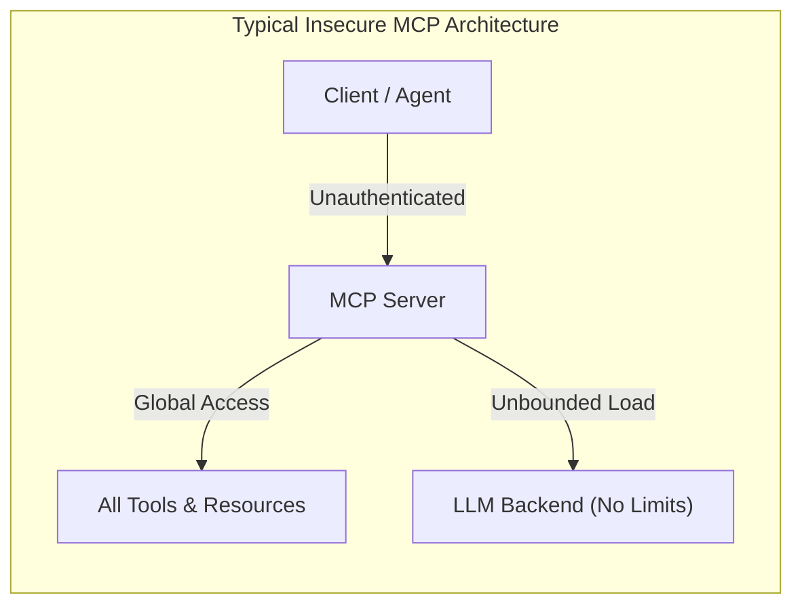
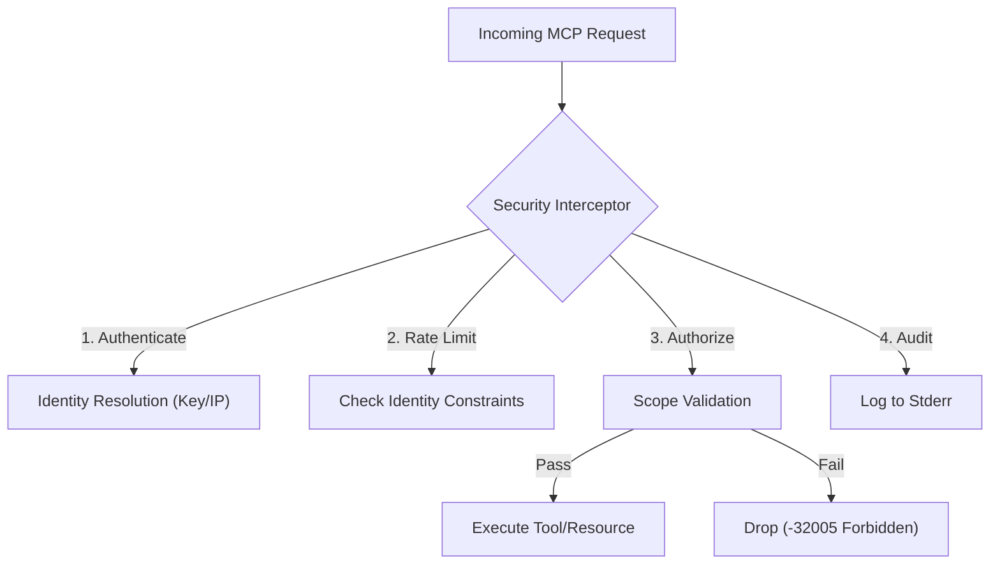
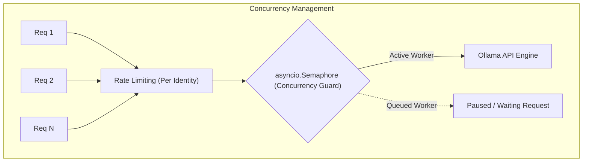
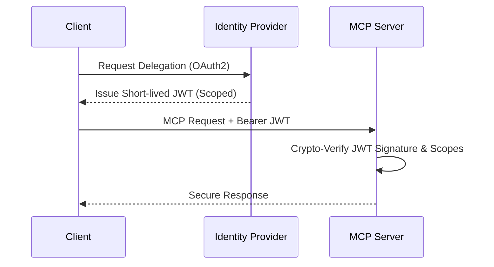

# MCP Security Architecture: Beyond the Tutorials

Most Model Context Protocol (MCP) tutorials and starter templates focus purely on the "happy path"—how to connect an LLM to a tool. However, in a real-world or shared environment, exposing an executable surface to AI agents without robust guardrails is a massive security risk.

This document details the common security gaps in typical MCP implementations and explains the comprehensive, defense-in-depth architecture utilized in this project.

---

## 1. Current Security Gaps in Typical MCP Architectures

When evaluating standard MCP examples, several critical security deficiencies are commonly found:

1. **Unauthenticated Access (The "Open Tool" Problem)**
   Many tutorials expose tools (especially over SSE/HTTP) without requiring any credentials. Anyone who can route to the port can parse the `tools/list` and execute arbitrary logic on the host machine.
2. **Coarse-Grained Authorization (All or Nothing)**
   Even systems that implement basic password mechanisms often suffer from "all-or-nothing" access. Once authenticated, an agent or user can call *any* tool or read *any* resource, violating the Principle of Least Privilege.
3. **No Rate Limiting or Provider Protection**
   LLM inferences and backend tools are resource-intensive. Standard implementations lack throttling, meaning a single aggressive client (or a runaway agent loop) can easily execute a Denial of Service (DoS) attack, crashing the server or the LLM.
4. **Lack of Auditability**
   Interactions (like an agent deciding to modify a file or query a database) are frequently not logged. If an incident occurs, there is no structured audit trail to answer *"Who executed what, when, and what was the outcome?"*
5. **Missing Request Boundaries**
   Blindly accepting massive JSON-RPC payloads without size limits or execution timeouts can lead to memory exhaustion or locked threads.

---

## 2. How This Project Secures the MCP Server

This repository takes a production-first approach. Rather than relying on the LLM or the client to "bebehave," security is enforced at the **Protocol Level** using a custom `SecurityInterceptor`.

### A. Protocol-level Security Interceptor
Rather than writing security logic inside every tool, the `SecurityInterceptor` wraps all MCP lifecycle and execution handlers (`initialize`, `tools/list`, `tools/call`, etc.). Every request must pass through this funnel.

### B. Transport-Aware Authentication & Identity Resolution
- **SSE (Network):** Requires an authorized API key provided via headers (e.g., `X-MCP-Client-Key` or `Authorization: Bearer`).
- **Stdio (Local):** Distinguishes between explicitly verified callers (via environment variables) and anonymous local processes.
- **Identity Labeling:** Instead of a simple `True/False` for auth, the architecture maps requests to an `Identity` (e.g., a truncated SHA-256 hash of the API key, or an IP address). This ensures secrets are never logged while uniquely identifying traffic.

### C. Fine-Grained Scopes (Least Privilege)
The project abandons global access. Handlers map directly to granular scopes:
- By default, a `prod` environment grants **zero scopes** (`[]`). Client keys must explicitly map to what they need.
- Tools request specific scopes at registration (e.g., `tools:execute`, `tools:weather:get`).
- If an Identity attempts to call `ollama-chat` but only holds the `tools:weather:get` scope, the Interceptor drops the request with a `-32005 Forbidden` error.

### D. Identity-Based Rate Limiting & Concurrency Control

- **Rate Limiting:** Bucketed by the client's Identity, protecting against individual spammers.
- **Provider Concurrency (The Semaphore):** The local Ollama implementation is protected by an `asyncio.Semaphore` (`ConcurrencyLimitedProvider`). Even if 100 valid clients request an inference simultaneously, the server limits active LLM threads to a safe upper bound, queuing the rest.

### E. Structured Audit Logging
Every attempt is securely logged to `stderr` (preserving `stdout` for stdio protocol traffic). Logs capture the exact method invoked, the resolved identity, and the final status (`SUCCESS`, `UNAUTHORIZED`, `FORBIDDEN`, `RATE_LIMITED`, or `ERROR`).

### F. Resilience & Workload Bounds
- **Request Size Protection:** Aborts payloads exceeding maximum JSON sizing to prevent memory DoS.
- **Execution Timeouts:** All intercepted calls are wrapped in an `asyncio.wait_for`. If a tool or LLM inference hangs, the server forcibly cancels it and cleans up the worker.

---

## 3. Future Enhancements & Alternative Security Methods

While this architecture is highly secure for internal and local scaling, enterprise or cloud-exposed MCP servers may consider the following alternative or additive methods:

* **mTLS (Mutual TLS):** Instead of Bearer tokens or API keys over HTTPS, using Client Certificates. This guarantees both the server and the agent/client cryptographically verify each other before establishing the TCP connection.
* **OAuth2 / OIDC Integration:** Instead of statically defining `auth_keys` in a configuration file, the server could validate short-lived JSON Web Tokens (JWTs) issued by an Identity Provider (like Keycloak, Auth0, or Okta). Scopes can be embedded directly inside the JWT's claims.

* **OS-Level Sandboxing / WebAssembly:** If tools perform arbitrary code execution (like a Python REPL tool), applying application-level scopes isn't enough. The execution environment itself should be placed inside a Docker container, gVisor sandbox, or WebAssembly (Wasm) runtime to isolate the host OS.
* **Data Loss Prevention (DLP):** An interceptor layer designed specifically for the payload's *content*. DLP middleware could inspect outgoing responses from tools/LLMs and redact Personally Identifiable Information (PII) before it ever reaches the requesting agent.
