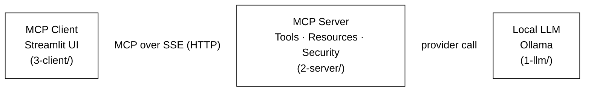
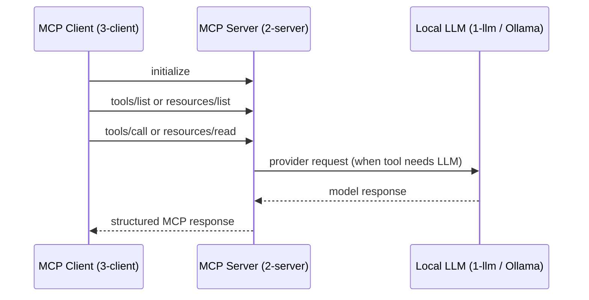

# Learn MCP: Secure, Local, and Decoupled

This repository is a **production-grade learning resource** for the [Model Context Protocol (MCP)](https://modelcontextprotocol.io/). It moves beyond simple "Hello World" examples to demonstrate how to build a modular, secure-by-default AI stack using **Ollama**, **FastMCP**, and **SSE/Stdio** transports.

> [!TIP]
> If you are completely new to MCP, read the **"What Is MCP?"** section below before anything else.

---

## What Is MCP?

MCP, or Model Context Protocol, is a standard way for an AI client to talk to tools, resources, and prompts exposed by a server.

In simple terms:

- the **client** asks for available capabilities
- the **server** exposes those capabilities in a standard format
- the **LLM** can use those capabilities through the client–server connection

The easiest mental model:

| Concept | What It Is |
|---------|-----------|
| **MCP Client** | The app that wants to use tools or fetch context |
| **MCP Server** | The app that publishes those tools/resources |
| **Tool** | An action the LLM can trigger, like `ollama-chat` or `echo` |
| **Resource** | Read-only context exposed by the server, like `config://server` |
| **Transport** | How client and server talk — `stdio` (local pipes) or `SSE` (HTTP) |

---

## What This Repo Teaches

By reading and running this project, you will learn:

- how an MCP server is structured and started
- how MCP tools are registered and called
- how MCP resources are exposed
- how a client connects, discovers capabilities, and calls tools
- how a local LLM can sit behind an MCP tool
- how security layers — auth, scopes, rate limiting, and audit logging — can be added at the protocol level

---

## 🎓 The Learning Path

The project is split into three numbered modules. **Follow them in order.**

```
1-llm/     → Set up the local LLM (Ollama). Foundation for everything else.
2-server/  → Build and understand the MCP server and its security layer.
3-client/  → Connect a Streamlit chat client to the running server over SSE.
```

1. **[Component 1: LLM Provider (`1-llm/`)](./1-llm/README.md)**
   — Install Ollama, pull a local model, and verify inference works.

2. **[Component 2: MCP Server (`2-server/`)](./2-server/README.md)**
   — The "brain" that negotiates tools and resources. Includes a custom security middleware, SSE and stdio transports, configuration, and a beginner walkthrough of every key file.

3. **[Component 3: MCP Client (`3-client/`)](./3-client/README.md)**
   — A Streamlit-based UI that connects to the server over SSE, demonstrates tool discovery, authenticated session management, and session isolation.

> [!IMPORTANT]
> Each component has its own README with setup instructions, a file-reading walkthrough, and a "next step" pointer. Do not skip ahead — the client requires the server, and the server requires the LLM.

---

## System Architecture

This is how the three components communicate at runtime:



The strict boundary is intentional: these components **only communicate via the Model Context Protocol**. This mirrors real-world deployments where agents, tools, and UI layers live on different infrastructure.

---

## How MCP Flows In Practice

Here is the normal interaction pattern for every request:



### Example protocol messages

**`initialize`**
```json
{
  "jsonrpc": "2.0",
  "method": "initialize",
  "params": {
    "protocolVersion": "2024-11-05",
    "clientInfo": { "name": "demo-client", "version": "1.0.0" },
    "capabilities": {}
  },
  "id": 1
}
```

**`tools/list`**
```json
{ "jsonrpc": "2.0", "method": "tools/list", "params": {}, "id": 2 }
```

**`tools/call`**
```json
{
  "jsonrpc": "2.0",
  "method": "tools/call",
  "params": { "name": "echo", "arguments": { "message": "hello from MCP" } },
  "id": 3
}
```

---

## 🔐 Security-First Architecture

Unlike typical tutorials, this project implements a **Defense-in-Depth** security model at the protocol level. Security is treated as a main architectural concern, not a later add-on.

### Key Security Features

- **Protocol-Level Interceptor** — A centralized funnel that validates every `initialize`, `tools/list`, and `tools/call` request before it touches server logic.
- **Identity Resolution** — Consistently identifies callers via API keys or IP addresses, using stable fingerprints (SHA-256) for logging instead of raw secrets.
- **Fine-Grained Scopes (Least Privilege)** — Access is controlled via granular scopes (e.g., `tools:weather:get`). Clients only see and execute what they are explicitly permitted.
- **Provider Concurrency Guard** — An `asyncio.Semaphore` protects the Ollama engine from being overwhelmed by simultaneous agent requests.
- **Identity-Based Rate Limiting** — Throttles traffic on a per-client basis to prevent DoS attacks or runaway agent loops.
- **Structured Audit Logging** — Comprehensive logs to `stderr` that capture actor identity, requested method, and authorization result (`SUCCESS` / `FORBIDDEN` / `THROTTLED`).

> [!TIP]
> For a deep dive into how the protocol is secured, see the [Security Architecture Document](./2-server/SECURITY_ARCHITECTURE.md).

---

## 🚀 Quick Setup (All-in-One)

If you already have Ollama installed and want to see the full secure stack in action:

### 1. Install all dependencies
```bash
make install
```

### 2. Start the server (Terminal 1)
```bash
make run-server-sse
```

### 3. Start the client UI (Terminal 2)
```bash
make run-client
```

The UI opens at [http://localhost:8501](http://localhost:8501).

> [!NOTE]
> For step-by-step setup of each component individually, follow the numbered module READMEs in order starting with [`1-llm/README.md`](./1-llm/README.md).

---

## Why This Structure?

By separating the **LLM**, **Server**, and **Client** into numbered, isolated directories:

- Each component has a single responsibility and can be understood independently.
- The client never accesses Ollama directly — it must go through the MCP security boundary.
- The server never knows what UI is in front of it — it speaks MCP only.
- You develop intuition for real-world AI architectures where these layers live on different machines.
